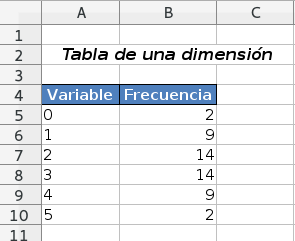

El trabajo diario en la [OPADA](http:://www.upct.es/opada), Universidad Politécnica de Cartagena, usa de manera intensiva R, el paquete `opadar` recopila distintas funciones útiles para manipular dataframes y producir ficheros Excel entregados a sus usuarios.

## A la hora de combinar dataframes con los verbos `..._join` de `dplyr` 

Una de las operaciones más comunes en la OPADA es combinar la información procedente de distintas tablas: si queremos obtener un desglose de los créditos matriculados en función del grado y el sexo de los alumnos, necesitaremos combinar la información contenida en una tabla sobre créditos, donde cada individuo estará identificado por su plan y su número de expediente, con la información sobre matrículas en cada plan que asocia plan y expediente con el DNI del estudiante, y finalmente información sobre el alumno en sí (Sexo, etc..). 

Para combinar la información recogida en distintos dataframes, generados en general a partir de select en SQL, usamos con mucha regularidad los verbos `inner_join`, `full_join`, `anti_join`,  `semi_join` y `right_join` de la librería `dplyr`. Para más información sobre estos verbos, se recomienda ver la vignette ["Two-table verbs"](https://cran.r-project.org/web/packages/dplyr/vignettes/two-table.html). 

Una de las fuentes más frecuentes de error, al combinar dos dataframes `x` y `y` con alguno de los verbos `..._join` se debe a que sin darnos cuenta, alguna fila en ` x` tiene más de una coincidencia en el dataframe `y` por lo que esta fila da origen a dos filas en el dataframe combinado. Esta duplicidad puede dar lugar a un recuento erróneo, al contar dos veces el mismo individuo por ejemplo.
También es posible que, alguna fila de `x` no tenga ninguna coincidencia en `y`. Según el verbo que usemos, esta fila podrá desaparecer o no en el dataframe combinado.

```{r}
(alumnos <- data.frame(plan = c("5051", rep("5041", 3)),
                      expediente = c(10, 1, 1, 2),
                      sexo = c("Hombre", "Mujer", "Mujer", "Hombre")))
(creditos  <- data.frame(anyo = c("2013-14",
                                 "2013-14",
                                 "2014-15"),
                        plan = rep("5041", 3),
                        expediente = c(1, 2, 2),
                        creditos = c(60, 60, 54)))
```


Antes de hacer un `..._join`, es imprescindible ser conscientes de las coincidencias de filas entre `x` e  `y`. Para ello, se puede hacer la función `info_join` de `opadar`.


```{r}
opadar::info_join(alumnos, creditos)
```

En este caso, nos damos cuenta, en particular, que

* una fila en `alumno` no tiene coincidencia en `creditos`.

* una fila en `alumno` tiene más de una coincidencia en `creditos`.

La síntaxis de los argumentos de `info_join` es exactamente la misma que para los verbos `..._join` de `dplyr`, por lo que se puede usar en particular `by = `, etc...

## Para escribir un dataframe a un archivo Excel, usando openxlsx

Muchas de los datos/indicadores solicitados por los usuarios de la OPADA se proporcionan en un archivo Excel. Puede contener varias hojas, y en cada hoja una o varias tablas con un título explicativo para cada una. La función `escribirTablaDatos` facilita y agrupa los diferentes pasos que se deben realizar usando `openxlsx`. Además permite la combinación vertical (merge) de celdas consecutivas que contienen el mismo valor.

### Primer ejemplo: escribir un o varios dataframes en un archivo.

```{r}
library("magrittr")
library("opadar")
(opada <- data.frame(Nombre = c("Álvaro", "Antonio", "Mari Carmen", "Mathieu"),
                    Sexo = c("Hombre", "Hombre", "Mujer", "Hombre"),
                    Edad = c(25, 25, 23, 25),
                    Nacionalidad = c("720", "720", "720", "250")) )
```

Usamos el operador `%>%` de magrittr, para escribir los comandos en cadena:

```{r, eval= FALSE}
openxlsx::createWorkbook() %>% 
  escribirTablaDatos(sheetName = "La OPADA",
                       x = opada,
                       titulo = "Miembros de la OPADA",
                       areaTitulo = "A2:D2",
                       withFilter = FALSE) %>%
  openxslx::saveWorkbook("ejemplo1.xlsx", overwrite = TRUE)
```
Obtenemos el archivo siguiente:

  

Podemos escribir dos tablas en la misma hoja, en una única cadena.

```{r}
(opada2 <- data.frame(Año = c("2014-15", "2015-16"),
                     Importe = c( 0, 10000)))
```

```{r}
openxlsx::createWorkbook() %>% 
  escribirTablaDatos(sheetName = "La OPADA",
                       x = opada,
                       titulo = "Miembros de la OPADA",
                       areaTitulo = "A2:D2",
                       withFilter = FALSE) %>%
  escribirTablaDatos(sheetName = "La OPADA",
                     x = opada2,
                     titulo = "Presupuesto de la OPADA",
                     areaTitulo = "A11:D11",
                     withFilter = FALSE) %>%
  openxlsx::saveWorkbook("ejemplo2.xlsx", overwrite = TRUE)
```

Obtenemos el archivo siguiente:

  

### Combinar celdas verticalmente para mejorar la presentación de tablas.

Cuando se trata de tablas, se suele combinar celdas verticales con los mismos valores para mejorar la presentación. En la imagen siguiente, aparece la misma tabla sin combinar celdas verticales (a la izquierda) y combinando celdas en las dos primeras columnas (a la derecha)

 

Para combinar verticalemente celdas, usamos el argumento `spanColumns` en `escribirTablaDatos`. Se trata de un vector que contiene los nombres de las variables del dataframe `x` en cuyas columnas se aplicará la combinación vertical.

Además, el orden de aparición de las columnas en `spanColumns` es importante: define la jerarquía de combinación. Se aplica la combinación de celdas en la primera columna de `spanColumns`, a continuación se aplica a la segunda columna en `spanColumns` pero condicionado a las celdas de la primera columna: no podrán combinarse dos celdas de la segunda columna, aunque sean iguales, si corresponden a dos celdas de contenido distinto en la primera columna.

Para ilustrarlo, consideremos el siguiente dataframe

```{r}
(tabla <- data.frame(plan = c(rep(c(5061,5121), times = rep(2, 2)),
                              rep(5041,2)),
                     centro = c(rep("ETSII", 4), rep("ETSIT", 2)),
                     sexo = rep(c("Mujer", "Hombre"), times = 3),
                     frecuencia = c(24, 90, 13, 50, 32, 40)))
```

Es natural combinar celdas de la columna `plan` y a continuación `centro`, lo conseguimos especificando `spanColumns = c("plan", "centro")`:

```{r, eval = FALSE}
openxlsx::createWorkbook() %>% 
  escribirTablaDatos(sheetName = "Alumnos en grados",
                         x = tabla,
                         titulo = "spanColumns = c(\"plan\", \"centro\")",
                         areaTitulo = "A2:E2",
                         spanColumns = c("plan", "centro"),
                     withFilter = FALSE) %>%
  openxlsx::saveWorkbook("tabla1.xlsx", overwrite = TRUE)
```

 

Nos fijamos en que en la columna `centro`, no se han combinado las dos primeras apariciones de "ETSII", puesto que corresponden a dos valores diferentes de `plan` que es el que domina la jerarquía al ser el primer elemento de `spanColumns`.

En cambio, si cambiamos el orden de `plan` y `centro` en spanColumns, obtenemos unas combinaciones diferentes:

```{r, eval = FALSE}
openxlsx::createWorkbook() %>% 
  escribirTablaDatos(sheetName = "Alumnos en grados",
                         x = tabla,
                         titulo = "spanColumns = c(\"centro\", \"plan\")",
                         areaTitulo = "A2:E2",
                         spanColumns = c("centro", "plan"),
                     withFilter = FALSE) %>%
  openxlsx::saveWorkbook("tabla2.xlsx", overwrite = TRUE)
```


 

En este caso, se combinan primero las celdas de `centro` por lo que "ETSII" abarca las cuatro primeras filas de la tabla, y a continuación las celdas de `plan`.

### NOTA: cuando se quiere escribir una tabla en un archivo Excel.

Para escribir una tabla en openxlsx usando `writeDataTable` y por lo tanto, también si se usa `escribirTablaDatos`, es necesario que el objeto sea un dataframe. 

Si se trata de una tabla de una dimensión, basta con usar `as.data.frame.table`:
```{r, eval = FALSE}
v <- rbinom(50, 5, 0.5)
tabla <- table(v)
x <- as.data.frame.table(tabla)
## cambiamos los nombres
names(x)<- c("Variable", "Frecuencia")
openxlsx::createWorkbook() %>% 
  escribirTablaDatos(sheetName = "Hoja 1",
                         x = x,
                         titulo = "Tabla de una dimensión",
                         areaTitulo = "A2:C2",
                     withFilter = FALSE) %>%
  openxlsx::saveWorkbook("tabla1d.xlsx", overwrite = TRUE)
```

 

Si se trata de una tabla de dos dimensiones, no resulta útil `as.data.frame.tabla` y podemos recurrir a `tabla2df` de nuestra librería opadar.

```{r, eval = FALSE}
v1 <- sample(c("Funcionario", "Laboral", "Otros"), 50, replace = TRUE)
v2 <- sample(c("Hombre", "Mujer"), 50, replace = TRUE, prob = c(0.25, 0.75))
x <-tabla2df(table(v1, v2), cabecerafilas = "Tipo de personal")
openxlsx::createWorkbook() %>% 
  escribirTablaDatos(sheetName = "Hoja 1",
                         x = x,
                         titulo = "Tabla de dos dimensiones",
                         areaTitulo = "A2:C2",
                     withFilter = FALSE) %>%
  openxlsx::saveWorkbook("tabla2d.xlsx", overwrite = TRUE)
```


 

